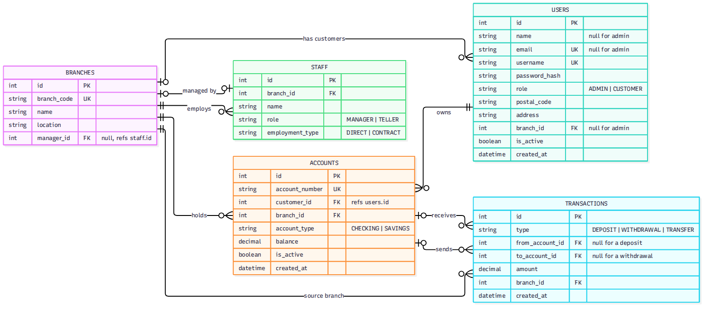

# Architecture

FastAPI, layered architecture, OAuth2 + JWT login. In-memory data first, MongoDB next.

#### Contents
1. [Domain Model](#domain-model)
2. [Service Model](#service-model)
3. [File Layout](#file-layout)
4. [Authentication](#authentication)
5. [API Reference](#api-reference)
6. [Error Handling](#error-handling)
7. [Persistence](#persistence)

## Domain Model

### Target Model

| Field | Note |
| - | - |
| `transactions.branch_id` | The branch of the account the money left; for a deposit (no source account) the branch it entered. Stored on the transaction so the monthly volume needs no join |
| `transactions.from_account_id`, `to_account_id` | `from_account_id` is null for a deposit (money comes from outside); `to_account_id` is null for a withdrawal |
| `users.name`, `users.email`, `users.branch_id` | Null only for the admin |
| `branches.manager_id` | Null until a manager is assigned. It refers to `staff.id`, and that person must work at the same branch (see the rules below) |
| Enum columns | `users.role` (ADMIN or CUSTOMER), `accounts.account_type` (CHECKING or SAVINGS), `transactions.type` (DEPOSIT, WITHDRAWAL or TRANSFER), `staff.role` (MANAGER or TELLER) `staff.employment_type` (DIRECT or CONTRACT) |

### Diagram Notes

Notes unable to be included in the Entity Relationship Diagram above:
- **Money Precision**: Balances & amounts are `DECIMAL(12,2)`
- **Relationship Rules**:
  - A transaction has at least one of `from_account_id` and `to_account_id`; a transfer has both and they differ
  - A branch's manager must work at that branch
  - Minimum balance, overdraft, and transfer limit live in the `Account` classes, not the database

### Business Logic
Enforced in `Account` classes:
- **Deposits & Withdrawals**: Are positive
- **Savings**: Never drops below the minimum balance
- **Checking**: May go negative up to the overdraft limit
- **Transfers**:
  - Have different, active accounts
  - Have an amount within the transfer limit
  - Have a source that passes its own rule
- **Simultaneous Withdrawals**: Cannot both pass the balance check

### Analytics
Definitions (rubric 1.3, 3.3):
- **Monthly Volume**: Sum of `TRANSFER` amounts per source-account branch for a `YYYY-MM` month
- **Staff-to-Manager Ratio**: Non-manager staff divided by managers
- **Contract Ratio**: `CONTRACT` staff divided by all staff, flagged when over `0.20`

## Service Model

### Data Layers
```bash
HTTP Request
→ Controller/Router
→ Service
→ Repository
→ Model
```

### Layer Responsibilities
| Layer | Does | Never Does |
| - | - | - |
| CONTROLLER | declare route / check token / validate body / pick status code | business rules / touching data |
| SERVICE | business rules / analytics (raises `NotFoundError` or `BadRequestError`) | building HTTP responses / touching data directly |
| REPOSITORY | the only code that reads / writes data (`find`, `get_by_id`, `add`, etc.) | business rules |
| MODEL | account classes / pydantic schemas | execution |

### One Request
> Step 3: Step 13 swaps this for MongoDB and nothing above it changes.
>
> Java to Python:
> - Main.main() and console menus become main.py and REST endpoints
> - ArrayList<Customer> becomes a repository
> - User / Customer become users
> - Account / SavingsAccount / CheckingAccount become the classes in Step 4

`POST /api/v1/transactions/transfer` end to end:
1. **Controller** (`routes/transactions/transfer.py`): checks the bearer token (`customer_only`), Pydantic validates the body, calls the service
2. **Service** (`bank_ops.transfer`): rejects same account and over-limit, builds `SavingsAccount` / `CheckingAccount` objects, calls `withdraw()` then `deposit()` (the model enforces minimum balance and overdraft), logs the transaction.
3. **Repository** (`lookup.find_account at first`): finds both accounts
4. Errors travel back as exceptions, and handlers in `main.py` turn them into `400`, `403`, or `404`. Success returns `201`.

## File Structure

### Target Layout
> Built in Step 12; Step 13 adds `db.py` and `seed_mongo.py`

```bash
Bank-App-Console/
├── app/
│   ├── controllers/        # routes (was routes/)
│   ├── services/           # bank_ops, analytics_logic, customer/account/branch services
│   ├── repositories/       # data access + db.py (Ch 3); lookup.py folds into account_repository
│   ├── models/             # domain.py + Pydantic schemas from core.py
│   ├── security.py         # from security.py
│   ├── exceptions.py
│   └── main.py
└── requirements.txt · README.md · .gitignore
```

### Key Files
- `security.py`
- `seed_data.py`
- `core.py`
- `domain.py`
- `lookup.py`
- `auth.py`
- `bank_ops.py`
- `analytics_logic.py`
- `routes/`
- `main.py`
- `smoke_test.py`, `demo.sh`
- `app/`
- `db.py`, `repositories/`, `seed_mongo.py`

## Authentication
> Built in Step 1, Step 6, and the token route in Step 9

### OAuth + JWT
FastAPI's **OAuth2** password flow with **JWT** bearer tokens:
- `POST /api/v1/auth/token`: Takes a form (username, password) & returns a token
- **Every Other Request**: sends `Authorization: Bearer <token>`

Testing in **Swagger**:
- Click **Authorize** to demo (every rubric endpoint needs a token)
- Tokens last 60 minutes
- `SECRET_KEY`: Set in your environment & never commit it

### Requirements
- [ ] bcrypt salted password hashing
- [ ] Login endpoint issuing access tokens
- [ ] JWT payload with `sub`, `email`, `roles`
- [ ] `Bearer <token>` verification on every route
- [ ] RBAC roles `ADMIN`, `CUSTOMER`
- [ ] Roles `TELLER`, `BRANCH_MANAGER`; refresh tokens; public registration (Chapter 5, later)

### Role Capabilities

#### `admin`
- **CRUD**: Create, Read (view/list), Update, Delete (dactivate) customers
- Open / Close accounts
- Branches
- List / Filter accounts & transactions
- Analytics
- **CANNOT** deposit / withdraw / transfer

#### `customer`
- Read (view) / Update *own* profile
- Deposit / Withdraw / Open extra accounts
- Transfer from *own* accounts
- Read (view) *own* transactions.

## API Reference

Paths shown without `/api/v1` prefix.

| Method | Endpoint | Access | Purpose | Rubric |
| - | - | - | - | - |
| POST | `/auth/token` | public | OAuth2 login: form `username` + `password`, returns a bearer token | 5 |
| POST | `/customers` | admin | Create customer + login (201) | 2.2 |
| GET | `/customers`, `/customers/me`, `/customers/{id}` | admin; customer; admin/owner | List; own profile; details | 2.2 |
| PUT | `/customers/me`, `/customers/{id}` | customer; admin/owner | Update info | 2.2 |
| DELETE | `/customers/{id}` | admin | **Deactivate** (`is_active=false`) | 2.2 |
| GET | `/customers/{id}/accounts` | admin/owner | Customer's accounts list | 1.1 |
| POST | `/accounts` | admin | Open account: customer_id, branch_id, account_type, initial_balance (201) | 2.2 |
| GET | `/accounts` | admin | List + filter `branch_id`, `min_balance`, `max_balance` | 1.3, 2.3 |
| GET | `/accounts/{id}`, `/accounts/{id}/customer` | admin | One account; its owner | 2.2 |
| DELETE | `/accounts/{id}` | admin | Close an extra account (pays out the balance) | 2.2 |
| POST | `/customers/me/bank-accounts` | customer | Open an extra checking/savings account | 2.2 |
| POST | `/customers/me/transactions` | customer | `DEPOSIT` / `WITHDRAWAL` (201) | 1.2 |
| POST | `/transactions/transfer` | customer | Transfer (201) | 2.2 |
| GET | `/transactions`, `/transactions/{id}` | admin all, customer own | List + filter `start_date`, `end_date`, `type`; get one | 2.2, 2.3 |
| POST | `/branches` | admin | Create a branch (201) | 2.2 |
| GET | `/branches`, `/branches/{id}` | any logged-in user | List; get one | 2.2 |
| PUT, DELETE | `/branches/{id}` | admin | Update; delete (400 while it still has accounts) | 2.2 |
| GET | `/branches/analytics/transfer-volume?month=2026-09` | admin | Monthly transfer volume per branch | 1.3, 3.3 |
| GET | `/branches/analytics/staff-manager-ratio?limit=3` | admin | Branches over the ratio | 1.3 |
| GET | `/branches/analytics/contract-staff?threshold=0.20` | admin | Branches over the contract ratio | 3.3 |

```json
POST /customers               {"name": "Rohit", "email": "rohit@test.com", "username": "rohit", "password": "rohit123", "postal_code": "20001", "address": "3 Park Ave", "branch_id": 1}
POST /accounts                {"customer_id": 1, "branch_id": 1, "account_type": "SAVINGS", "initial_balance": 5000}
POST /transactions/transfer   {"from_account_id": 1, "to_account_id": 2, "amount": 500}
```

Transfer Checks:
- Accounts exist (`404`)
- Source belongs to the caller (`403`)
- Both active, amount above zero, within the transfer limit, source rule respected (`400`)
- Balances updated
- Transaction recorded

Filters:
- Optional query parameters; omitted ones are skipped
- Customers only see transactions they sent or received

Status Codes:
- `200`: OK
- `201`: created
- `400`: invalid input (validation errors mapped from FastAPI's 422, plus rule violations)
- `401`: bad login or token
- `403`: not allowed
- `404`: not found
- `500`: unexpected (catch-all handler)
